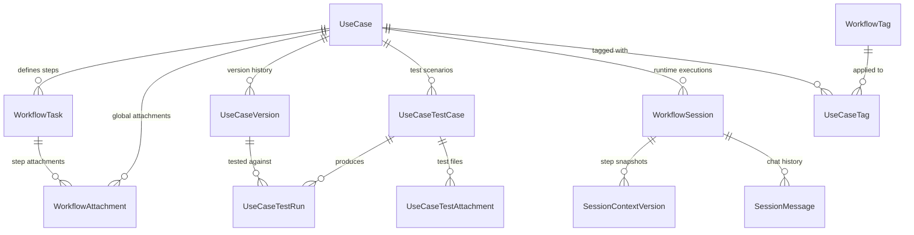
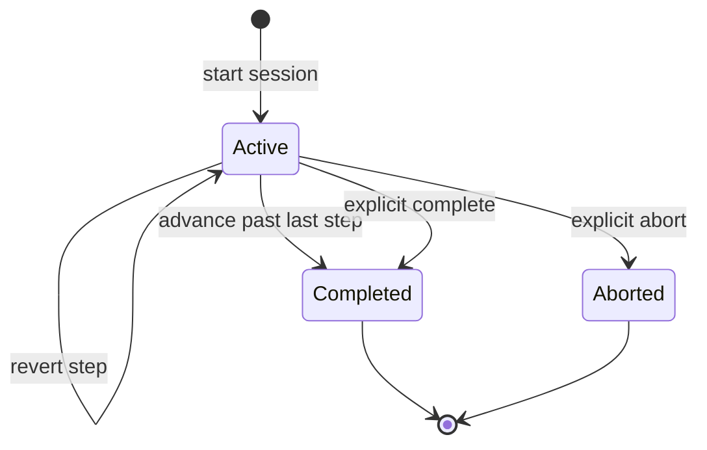
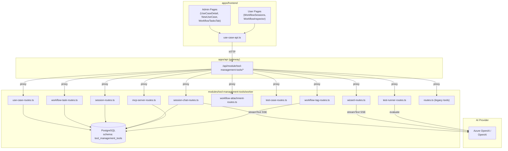
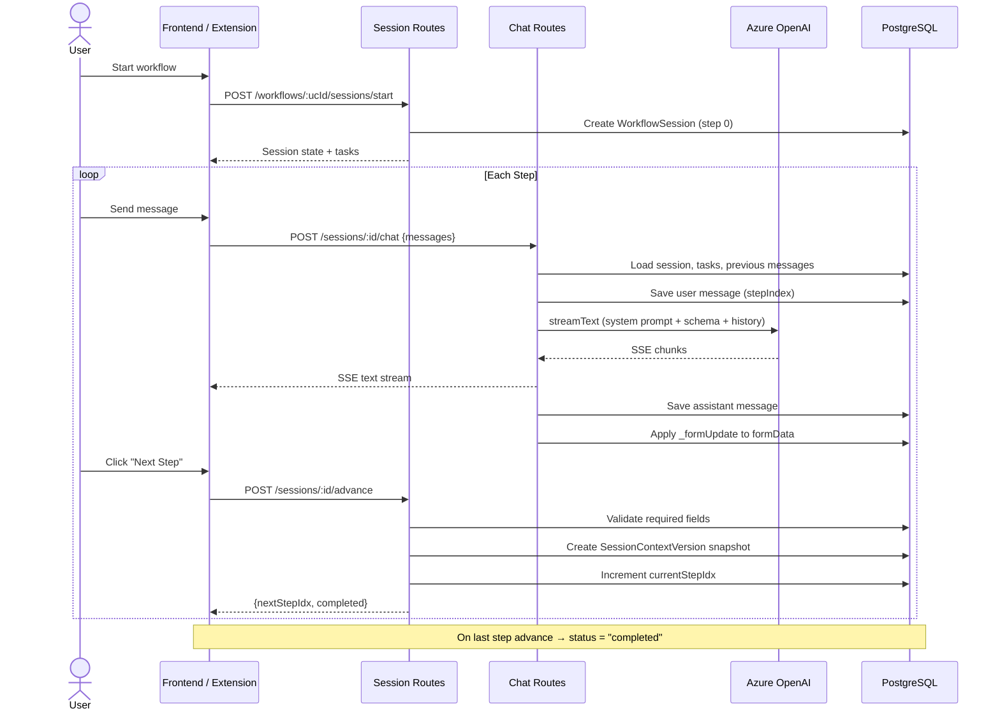
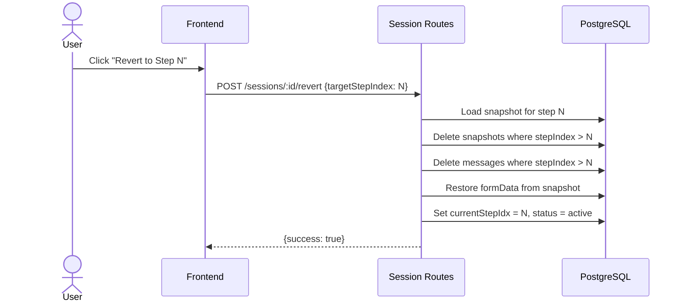
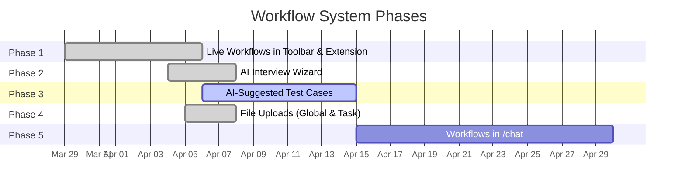

# Workflow System

> Multi-step, AI-guided structured procedures built on top of the Use Case system.

The Workflow System evolves Surdej's "Use Cases" into a multi-step execution engine.
Admins define structured procedures (tasks) with scoped system prompts, MCP tools,
and JSON Schema data requirements. End users execute them as interactive sessions
where an AI assistant guides them through each step, collecting structured data
along the way.

**Module:** `tool-management-tools`
**Worker port:** 7005
**Gateway proxy:** `/api/module/tool-management-tools/*`

---

## Data Model

The data model is split into three layers: **template** (design-time), **runtime**
(execution-time), and **quality** (testing).

### Entity Relationship



### Template Layer (Design-Time)

#### UseCase

The root entity. When `workflowMode = true`, it acts as a multi-step workflow
template; otherwise it behaves as a legacy single-prompt use case.

| Column | Type | Purpose |
|--------|------|---------|
| `id` | UUID | Primary key |
| `tenantId` | UUID? | null = global/built-in |
| `slug` | string | Unique machine key (`onboard-prospect`) |
| `label` | string | Display name |
| `description` | text? | Admin description |
| `icon` | string? | Lucide icon name |
| `isBuiltIn` | bool | Platform-provided vs user-created |
| `isActive` | bool | Visible to end users |
| `workflowMode` | bool | **false** = single-prompt, **true** = multi-step |
| `tags` | string[] | Classification tags |
| `metadata` | JSON? | Arbitrary config |

#### WorkflowTask

An individual step within a workflow. Tasks are ordered by `sortOrder` and
each one carries its own AI prompt, tool scope, and data requirements.

| Column | Type | Purpose |
|--------|------|---------|
| `id` | UUID | Primary key |
| `useCaseId` | UUID | FK → UseCase |
| `taskId` | string | Human-readable key (`research_company`) |
| `title` | string | Display title (`1. Company Research`) |
| `sortOrder` | int | Ordering within the workflow |
| `systemPrompt` | text | Step-specific AI system prompt |
| `allowedTools` | string[] | Scoped MCP tool names for this step |
| `dataSchema` | JSON | JSON Schema defining required/optional fields |
| `description` | text? | Admin notes |

**Unique constraint:** `(useCaseId, taskId)`

##### dataSchema format

Standard JSON Schema subset used to describe what data must be collected:

```json
{
  "type": "object",
  "required": ["companyName", "recentNews"],
  "properties": {
    "companyName": { "type": "string", "description": "Target company" },
    "recentNews": { "type": "string", "description": "Recent initiatives" }
  }
}
```

#### UseCaseVersion

Immutable snapshot of a use case's global configuration at a point in time.

| Column | Type | Purpose |
|--------|------|---------|
| `version` | int | Auto-incremented per use case |
| `promptTemplate` | text | Global system prompt |
| `tools` | string[] | Tool IDs available in this version |
| `modelTier` | string | `low` / `medium` / `high` / `reasoning` |
| `changelog` | text? | What changed |

#### WorkflowAttachment

Documents attached at either the global (UseCase) or step (WorkflowTask) level.
Injected into the AI context as reference material.

| Column | Type | Purpose |
|--------|------|---------|
| `useCaseId` | UUID? | Global attachment (null if task-specific) |
| `taskId` | UUID? | Task-specific attachment (null if global) |
| `filename` | string | Original filename |
| `mimeType` | string | MIME type |
| `sizeBytes` | int | File size |
| `data` | bytes | Binary content |

### Runtime Layer (Execution-Time)



#### WorkflowSession

Created when a user starts a workflow. Tracks position, accumulated data,
and lifecycle status.

| Column | Type | Purpose |
|--------|------|---------|
| `id` | UUID | Primary key |
| `useCaseId` | UUID | FK → UseCase (which workflow template) |
| `userId` | string | Owner of the session |
| `tenantId` | UUID? | Tenant scope |
| `currentStepIdx` | int | 0-based index into the ordered task list |
| `status` | string | `active` / `completed` / `aborted` |
| `formData` | JSON | Aggregated field values across all steps |

#### SessionContextVersion

Checkpoint snapshot created every time a step is advanced. Enables reverting
to a prior step by restoring the `formData` state and deleting subsequent
messages/snapshots.

| Column | Type | Purpose |
|--------|------|---------|
| `sessionId` | UUID | FK → WorkflowSession |
| `stepIndex` | int | Which step was just completed |
| `formData` | JSON | Snapshot of accumulated data at this point |

**Unique constraint:** `(sessionId, stepIndex)`

#### SessionMessage

Chat messages scoped by step. When the user reverts to a prior step, messages
belonging to later steps are deleted.

| Column | Type | Purpose |
|--------|------|---------|
| `sessionId` | UUID | FK → WorkflowSession |
| `stepIndex` | int | Which task this message belongs to |
| `role` | string | `user` / `assistant` / `system` |
| `content` | text | Message body |
| `metadata` | JSON? | Tool calls, reasoning traces, etc. |

**Index:** `(sessionId, stepIndex)`

### Quality Layer (Testing)

| Entity | Purpose |
|--------|---------|
| `UseCaseTestCase` | Test scenario: `userPrompt` + `evaluationPrompt` + `expectedBehavior` |
| `UseCaseTestAttachment` | Binary files attached to a test case |
| `UseCaseTestRun` | Result of running a test against a `UseCaseVersion` (`passed`/`failed`/`error`) |

### Tagging Layer

#### WorkflowTag

Named tag for categorizing workflows. Managed via admin UI.

| Column | Type | Purpose |
|--------|------|---------|
| `id` | UUID | Primary key |
| `name` | string | Unique slug (`research`, `analysis`) |
| `label` | string | Display name |
| `color` | string | Hex color for badge (default `#6b7280`) |
| `description` | text? | Optional description |
| `sortOrder` | int | Ordering |

#### UseCaseTag

Join table linking use cases to tags.

| Column | Type | Purpose |
|--------|------|---------|
| `useCaseId` | UUID | FK → UseCase |
| `tagId` | UUID | FK → WorkflowTag |

**Primary key:** `(useCaseId, tagId)`

---

## Architecture

### System Overview



### Session Execution Flow



### Step Revert Flow



### AI System Prompt Injection

At chat time, the system prompt sent to the AI is dynamically composed from:

```
┌───────────────────────────────────────────┐
│  1. Task system prompt (admin-authored)   │
│                                           │
│  2. Workflow progress                     │
│     "Step 2 of 5: Draft Outreach"         │
│                                           │
│  3. Previously collected data             │
│     {companyName: "Acme", ...}            │
│                                           │
│  4. Attachment references                 │
│     - policy.pdf (application/pdf, 42KB)  │
│                                           │
│  5. Data collection requirements          │
│     - emailSubject (string) [REQUIRED]    │
│     - emailBody (string) [REQUIRED]       │
│     - tone (string) [OPTIONAL]            │
│                                           │
│  6. _formUpdate instructions              │
│     "Respond with JSON block to fill..."  │
│                                           │
│  7. Missing field nudge                   │
│     "IMPORTANT: emailSubject is empty"    │
└───────────────────────────────────────────┘
```

The AI auto-populates form fields by emitting `_formUpdate` JSON blocks:

```json
{ "_formUpdate": { "emailSubject": "Partnership Opportunity with Acme" } }
```

These are parsed from the response text (both fenced and inline formats)
and merged into `WorkflowSession.formData`.

### Model Tier Resolution

| Tier | Default Model | Env Override |
|------|---------------|--------------|
| `low` | gpt-4o-mini | `AI_MODEL_LOW` |
| `medium` | gpt-4o | `AI_MODEL_MEDIUM` |
| `high` | gpt-4o | `AI_MODEL_HIGH` |
| `reasoning` | o3-mini | `AI_MODEL_REASONING` |

---

## API Reference

All endpoints are proxied through the gateway at `/api/module/tool-management-tools/`.

### Use Cases

| Method | Endpoint | Purpose |
|--------|----------|---------|
| GET | `/use-cases/active` | Active use cases + built-in fallbacks |
| GET | `/use-cases` | List all (opt. `?includeBuiltIn=true`) |
| GET | `/use-cases/:id` | Detail with versions, test cases, tasks |
| POST | `/use-cases` | Create (`slug`, `label`, `workflowMode`) |
| PUT | `/use-cases/:id` | Update metadata |
| DELETE | `/use-cases/:id` | Soft-delete |

### Versions

| Method | Endpoint | Purpose |
|--------|----------|---------|
| POST | `/use-cases/:id/versions` | Create version (promptTemplate, tools, modelTier) |
| GET | `/use-cases/:id/versions` | List versions |
| GET | `/use-cases/:ucId/versions/:vId` | Get version detail with test runs |

### Workflow Tasks

| Method | Endpoint | Purpose |
|--------|----------|---------|
| GET | `/use-cases/:ucId/tasks` | List tasks (ordered) |
| POST | `/use-cases/:ucId/tasks` | Create task |
| PUT | `/use-cases/:ucId/tasks/:taskId` | Update task |
| DELETE | `/use-cases/:ucId/tasks/:taskId` | Delete task |
| PATCH | `/use-cases/:ucId/tasks/reorder` | Reorder by ID array |

### Sessions

| Method | Endpoint | Purpose |
|--------|----------|---------|
| POST | `/workflows/:ucId/sessions/start` | Start new session |
| GET | `/sessions/:sessionId` | Get state + current messages |
| POST | `/sessions/:sessionId/advance` | Validate fields → snapshot → next step |
| POST | `/sessions/:sessionId/revert` | Restore snapshot → delete subsequent data |
| POST | `/sessions/:sessionId/update-form` | Partial merge of form fields |
| POST | `/sessions/:sessionId/complete` | Mark completed explicitly |
| POST | `/sessions/:sessionId/abort` | Mark aborted |
| GET | `/workflows/:ucId/sessions` | User's sessions for a workflow |
| GET | `/sessions` | All sessions for current user |
| GET | `/sessions/:sessionId/debug` | Debug view: session + tasks + snapshots + messages |
| GET | `/admin/sessions` | All sessions globally (admin) |

### Session Chat (SSE Streaming)

| Method | Endpoint | Purpose |
|--------|----------|---------|
| POST | `/sessions/:sessionId/chat` | Stream AI response (schema-aware, auto-form-update) |

### Attachments

| Method | Endpoint | Purpose |
|--------|----------|---------|
| GET | `/use-cases/:ucId/attachments` | List global attachments |
| POST | `/use-cases/:ucId/attachments` | Upload global attachment |
| POST | `/use-cases/:ucId/tasks/:taskId/attachments` | Upload task-specific attachment |
| GET | `/workflow-attachments/:attId` | Download |
| DELETE | `/workflow-attachments/:attId` | Delete |

### AI Wizard

| Method | Endpoint | Purpose |
|--------|----------|---------|
| POST | `/use-cases/wizard/chat` | SSE chat with AI architect for workflow creation |

### Test Cases & Runner

| Method | Endpoint | Purpose |
|--------|----------|---------|
| GET | `/use-cases/:ucId/test-cases` | List test cases |
| GET | `/use-cases/:ucId/test-cases/:tcId` | Get test case detail |
| POST | `/use-cases/:ucId/test-cases` | Create test case |
| PUT | `/use-cases/:ucId/test-cases/:tcId` | Update |
| DELETE | `/use-cases/:ucId/test-cases/:tcId` | Delete |
| POST | `/use-cases/:ucId/suggest-tests` | AI-suggest test scenarios |
| POST | `/use-cases/:ucId/test-cases/:tcId/attachments` | Upload test attachment |
| GET | `/test-attachments/:attId` | Download test attachment |
| DELETE | `/test-attachments/:attId` | Delete test attachment |
| POST | `/use-cases/:ucId/run-tests` | Execute tests against a version |
| GET | `/use-cases/:ucId/test-runs` | Test run history |
| GET | `/use-cases/:ucId/test-runs/:runId` | Test run detail |

### Workflow Tags

| Method | Endpoint | Purpose |
|--------|----------|---------|
| GET | `/workflow-tags` | List all tags |
| POST | `/workflow-tags` | Create tag (`name`, `label`, `color`) |
| PUT | `/workflow-tags/:id` | Update tag |
| DELETE | `/workflow-tags/:id` | Delete tag |
| GET | `/use-cases/:id/tags` | Get tags for a use case |
| PUT | `/use-cases/:id/tags` | Set tags for a use case (array of tag IDs) |

### MCP Servers & Tools

| Method | Endpoint | Purpose |
|--------|----------|---------|
| GET | `/mcp-servers` | List all MCP servers |
| GET | `/mcp-servers/:id` | Get server detail |
| POST | `/mcp-servers` | Register new MCP server |
| PUT | `/mcp-servers/:id` | Update server config |
| DELETE | `/mcp-servers/:id` | Delete server |
| PATCH | `/mcp-servers/:id/toggle` | Enable/disable server |
| POST | `/mcp-servers/:id/health-check` | Run health check |
| POST | `/mcp-servers/:id/discover` | Discover tools from server |
| GET | `/mcp-servers/:id/tools` | List tools for server |
| POST | `/mcp-servers/:id/tools` | Register tool manually |
| PUT | `/mcp-servers/:serverId/tools/:toolId` | Update tool |
| PATCH | `/mcp-servers/:serverId/tools/:toolId` | Toggle tool |
| DELETE | `/mcp-servers/:serverId/tools/:toolId` | Delete tool |

### Legacy Tools

| Method | Endpoint | Purpose |
|--------|----------|---------|
| GET | `/` | List all tools |
| GET | `/:id` | Get tool detail |
| POST | `/` | Create tool |
| PUT | `/:id` | Update tool |
| PATCH | `/:id/toggle` | Enable/disable |
| DELETE | `/:id` | Delete tool |

---

## Frontend Pages

Routes are split across two route groups:
- `/modules/tool-management-tools/*` — tool & MCP server admin
- `/modules/workflow/*` — workflow directory, sessions, and execution

| Page | Route | Purpose |
|------|-------|---------|
| **ToolManagementDashboard** | `/modules/tool-management-tools` | Admin: legacy tools + MCP servers |
| **NewToolPage** | `/modules/tool-management-tools/new` | Admin: create legacy tool |
| **NewMcpServerPage** | `/modules/tool-management-tools/mcp-servers/new` | Admin: register MCP server |
| **WorkflowFavoritesPage** | `/modules/workflow` | User: favorite/pinned workflows |
| **WorkflowDirectoryPage** | `/modules/workflow/directory` | User: browse all available workflows |
| **NewUseCasePage** | `/modules/workflow/new` | Admin: AI wizard + live preview |
| **UserWorkflowSessionsPage** | `/modules/workflow/sessions` | User: active/completed sessions |
| **WorkflowInspectorPage** | `/modules/workflow/inspector/:sessionId` | Execution: step-by-step workflow runner |
| **WorkflowDebugPage** | `/modules/workflow/debug/:sessionId` | Debug: task hierarchy, event log, form data |
| **UseCaseDetailPage** | `/modules/workflow/:useCaseId` | Admin: tabs (Overview, Versions, Tests, Tasks) |

Supporting components (not routed directly):
- **WorkflowTasksTab** — task editor tab within UseCaseDetailPage
- **WorkflowTagPicker** — tag selection widget used in workflow forms

---

## Implementation Status

### Phase Overview



### Detailed Status

| Feature | Status | Notes |
|---------|--------|-------|
| **UseCase CRUD** | ✅ Done | Create, update, soft-delete, list, detail |
| **workflowMode flag** | ✅ Done | Distinguishes single-prompt vs multi-step |
| **WorkflowTask CRUD** | ✅ Done | Add, edit, delete, reorder tasks |
| **dataSchema validation** | ✅ Done | JSON Schema on tasks, validated at advance |
| **UseCaseVersion management** | ✅ Done | Immutable snapshots, model tier, changelog |
| **Session lifecycle** | ✅ Done | Start, advance, revert, abort, complete |
| **SessionContextVersion snapshots** | ✅ Done | Created on advance, restored on revert |
| **Step-scoped chat** | ✅ Done | Messages tagged by stepIndex, SSE streaming |
| **Schema-aware system prompts** | ✅ Done | Auto-inject field requirements into prompt |
| **_formUpdate auto-parsing** | ✅ Done | AI populates fields via JSON blocks |
| **Previous step data injection** | ✅ Done | Accumulated formData in context |
| **Model tier resolution** | ✅ Done | low/medium/high/reasoning → model names |
| **AI Wizard (workflow creation)** | ✅ Done | Chat-based design with `_wizardProposal` |
| **Attachment backend** | ✅ Done | Upload, download, delete (global + task) |
| **Test case framework** | ✅ Done | CRUD, run, evaluate, history |
| **Admin UI (all tabs)** | ✅ Done | List, detail, tasks, versions, tests, runner |
| **User sessions list** | ✅ Done | My active/completed sessions |
| **Workflow Inspector** | ✅ Done | Debug view with task hierarchy & event log |
| **Active use cases API** | ✅ Done | Dynamic fetching for toolbar/extension |
| **MCP server management** | ✅ Done | CRUD, health checks, tool discovery, toggle |
| **Workflow tags** | ✅ Done | Tag CRUD, use case ↔ tag assignment |
| **Workflow directory & favorites** | ✅ Done | Browse, search, pin workflows |
| **Session debug endpoint** | ✅ Done | `/sessions/:sessionId/debug` |
| **Test case attachments** | ✅ Done | Upload, download, delete |
| **AI test suggestions** | ⚠️ Partial | Endpoint exists, returns mocked responses |
| **Attachment UI in task editor** | ⚠️ Partial | Backend done, upload UI not integrated |
| **Extension workflow UI** | ⚠️ Partial | Basic use case selection works, no stepper/form |
| **MCP tool scoping** | ❌ Not started | `allowedTools` stored but not enforced at chat time |
| **Auth context integration** | ❌ Not started | Uses generic `x-user-id` headers |
| **User session resumption** | ❌ Not started | No "Resume Session" in toolbar |
| **Workflows in `/chat`** | ❌ Not started | Phase 5 — embed in main chat view |
| **E2E test coverage** | ❌ Not started | No integration tests for full session flow |

---

## Wish List

Features and improvements not yet planned but would strengthen the system:

### High Priority

- **MCP Tool Enforcement** — Actually restrict AI tool calls to
  `WorkflowTask.allowedTools` at chat time (currently stored but ignored).
- **Session Resumption** — Add "Resume" button in toolbar/extension
  so users can pick up where they left off.
- **Auth Context** — Replace `x-user-id` / `x-tenant-id` headers with
  real MSAL auth context propagation from the gateway.
- **Attachment Content Injection** — Parse text/PDF attachments and inject
  their content into the system prompt, not just metadata references.

### Medium Priority

- **Conditional Branching** — Allow tasks to define `nextTaskId` based on
  field values, enabling non-linear workflows (decision trees).
- **Parallel Steps** — Some steps could execute simultaneously; add a
  `parallelGroup` field to WorkflowTask.
- **Webhook / External Triggers** — Kick off workflows from external events
  (email received, form submitted, NATS message).
- **Output Templates** — Each workflow defines an output template (markdown,
  email, document) that is auto-rendered from the final `formData`.
- **Session Expiry** — Auto-abort sessions that have been idle for a
  configurable period.
- **Rate Limiting** — Per-user session creation limits to prevent abuse.
- **Workflow Duplication** — Clone a workflow template including all tasks,
  attachments, and test cases.
- **Collaboration** — Multiple users on the same session, each assigned
  specific steps.
- **Real AI Test Suggestions** — Replace mocked `/suggest-tests` with
  actual AI analysis of the workflow structure.

### Low Priority / Nice-to-Have

- **Workflow Analytics** — Dashboard showing completion rates, average time
  per step, drop-off points, and field fill rates.
- **Approval Gates** — Steps that require a manager/reviewer to approve
  before the session can advance.
- **Scheduled Workflows** — Cron-triggered sessions that auto-start with
  pre-filled data from external sources.
- **Workflow Marketplace** — Share/import workflow templates between
  Surdej deployments.
- **Version Diff UI** — Visual diff between UseCaseVersions showing
  prompt/tool/config changes.
- **Form UI in Chat** — Render interactive form fields inline in the chat
  stream rather than having a separate form panel.
- **Step-Level Model Tier** — Override model tier per task (e.g., use
  `reasoning` tier for complex analysis steps, `low` for simple data entry).
- **Audit Log** — Track who modified workflow definitions and when, with
  rollback capability.
- **Blob Storage Migration** — Move `WorkflowAttachment.data` from DB
  `Bytes` to Azure Blob Storage for large files.

---

## File Locations

| Area | Path |
|------|------|
| Prisma schema | `modules/tool-management-tools/worker/prisma/schema/tool_management_tools.prisma` |
| Migrations | `modules/tool-management-tools/worker/prisma/migrations/` |
| Worker server | `modules/tool-management-tools/worker/src/server.ts` |
| Use case routes | `modules/tool-management-tools/worker/src/use-case-routes.ts` |
| Session routes | `modules/tool-management-tools/worker/src/session-routes.ts` |
| Session chat | `modules/tool-management-tools/worker/src/session-chat-routes.ts` |
| Task routes | `modules/tool-management-tools/worker/src/workflow-task-routes.ts` |
| Attachment routes | `modules/tool-management-tools/worker/src/workflow-attachment-routes.ts` |
| Wizard routes | `modules/tool-management-tools/worker/src/wizard-routes.ts` |
| Test case routes | `modules/tool-management-tools/worker/src/test-case-routes.ts` |
| Test runner routes | `modules/tool-management-tools/worker/src/test-runner-routes.ts` |
| MCP server routes | `modules/tool-management-tools/worker/src/mcp-server-routes.ts` |
| Workflow tag routes | `modules/tool-management-tools/worker/src/workflow-tag-routes.ts` |
| Legacy tool routes | `modules/tool-management-tools/worker/src/routes.ts` |
| Shared Zod schemas | `modules/tool-management-tools/shared/src/schemas.ts` |
| Frontend API client | `apps/frontend/src/routes/modules/tool-management-tools/use-case-api.ts` |
| Frontend pages | `apps/frontend/src/routes/modules/tool-management-tools/` |
| Frontend routes | `apps/frontend/src/App.tsx` (under `modules/workflow` and `modules/tool-management-tools`) |
| Original plan | `plans/workflow.md` |
| Implementation plan | `plans/workflow-implementation.md` |
