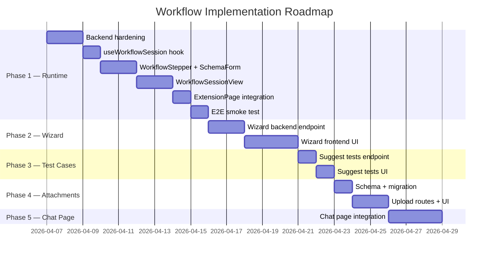

# Workflow Management System — Implementation Plan

> **Source spec:** [`plans/workflow.md`](file:///Users/niels/Code/pdf-refinery-surdej-v1/plans/workflow.md)
> **Module:** `modules/tool-management-tools/`
> **Created:** 2026-04-06

---

## Current State (Baseline)

The codebase already has significant scaffolding from earlier iterations. This plan treats that scaffolding as **raw material** — some of it is usable, some needs rework, and some needs to be built from scratch. Here is what exists today:

### Already in place

| Layer | What exists | Status |
|-------|------------|--------|
| **Prisma schema** | `UseCase`, `UseCaseVersion`, `WorkflowTask`, `WorkflowSession`, `SessionContextVersion`, `SessionMessage` models | Correct, usable as-is |
| **Shared Zod DTOs** | `schemas.ts` has `WorkflowTaskSchema`, `WorkflowSessionSchema`, `SessionContextVersionSchema`, `SessionMessageSchema`, `DataSchemaSchema` | Correct, usable as-is |
| **Worker routes — Use Cases** | Full CRUD (`use-case-routes.ts`): list, get, create, update, soft-delete, versions | Working |
| **Worker routes — Workflow Tasks** | CRUD (`workflow-task-routes.ts`): list, create, update, delete, reorder | Working |
| **Worker routes — Sessions** | Start, get, advance, revert, update-form, complete, abort, list (`session-routes.ts`) | Working but untested at runtime |
| **Worker routes — Session Chat** | SSE streaming chat with schema-awareness injection, `_formUpdate` parsing (`session-chat-routes.ts`) | Working but untested at runtime |
| **Frontend API client** | `use-case-api.ts` has typed functions for tasks, sessions, form updates | Working |
| **Frontend — Admin UI** | `WorkflowTasksTab.tsx`: CRUD for tasks within a use case detail page | Basic, working |
| **Frontend — Header toolbar** | `UseCasesDialog` fetches `/use-cases/active`, shows dynamic list, falls back to `BUILT_IN_USE_CASES` | Working |
| **Frontend — Extension** | `ExtensionPage.tsx` fetches active use cases, resolves `?useCase=` param, basic chat with prompt template prepending | Working but no workflow step UI |
| **Built-in fallbacks** | `BUILT_IN_USE_CASES` array (6 items, all `workflowMode: false`) | Present |

### Missing / needs building

| What | Notes |
|------|-------|
| **Workflow step UI in extension** | No stepper, progress header, schema-driven form, or "Next/Back" navigation exists in `ExtensionPage.tsx` |
| **Workflow step UI in `/chat`** (Phase 5) | No integration at all |
| **AI Interview Wizard** (Phase 2) | `NewUseCasePage.tsx` is a plain form, not an AI-guided wizard |
| **AI-Suggested Test Cases** (Phase 3) | No endpoint or UI |
| **File Uploads on workflows** (Phase 4) | No attachment model on `WorkflowTask` or `UseCase` |
| **`GET /use-cases/active` workflow enrichment** | Returns `tasks` but the extension doesn't use them |
| **End-to-end runtime integration** | Session chat, form updates, advance/revert are untested |
| **MCP tool scoping per step** | `allowedTools` is stored but not enforced at chat time (uses hardcoded `MODEL`) |

---

## Implementation Phases

### Phase 1 — Live Workflows in Toolbar & Extension

> **Goal:** The extension panel can execute a multi-step workflow session end-to-end, with the stepper UI, schema forms, and AI chat scoped per step.

#### 1.1 Backend: Harden session + chat routes

- [ ] **Verify session routes** — Write integration tests for start, advance, revert, update-form, complete, abort.
- [ ] **Auth context** — Replace `x-user-id` / `anonymous` with real user identity from the API gateway auth middleware. Wire `userId` and `tenantId` from the JWT/session.
- [ ] **Session chat — tool scoping** — Use `currentTask.allowedTools` to filter which MCP tools are injected into the `streamText` call.
- [x] **Session chat — model tier** — Resolve model from the use case version's `modelTier` field instead of hardcoded `gpt-4o`.
- [x] **Session chat — conversation history** — Include previous messages from the same step for conversation continuity.
- [x] **Session chat — missing field guidance** — AI is instructed to proactively ask for unfilled required fields.
- [x] **Session chat — improved _formUpdate parsing** — Supports multiple blocks, fenced and unfenced formats.
- [x] **Session chat — SSE error display** — Error events are now shown in the chat UI.
- [x] **`GET /use-cases/active` enrichment** — Verified working with `tasks` and `dataSchema`.

**Files to modify:**
- `modules/tool-management-tools/worker/src/session-routes.ts`
- `modules/tool-management-tools/worker/src/session-chat-routes.ts`
- `modules/tool-management-tools/worker/src/use-case-routes.ts`

#### 1.2 Frontend: Active use cases with workflow awareness

- [x] **`ActiveUseCase` type** — Added `tasks?: WorkflowTask[]` field to the `ActiveUseCase` interface in `use-case-api.ts`.
- [x] **`fetchActiveUseCases`** — Verified working. Frontend consumers check `workflowMode` and branch behavior.
- [x] **API client fixes** — Fixed empty POST body errors for `startSession`, `advanceSession`. Added `abortSession`, `completeSessionExplicit` functions.

**Files to modify:**
- `apps/frontend/src/routes/modules/tool-management-tools/use-case-api.ts`

#### 1.3 Extension: Workflow Session UI (the big one)

This is the core deliverable. The `ExtensionPage.tsx` currently renders a flat chat. When a workflow-mode use case is selected, it needs to switch to a **guided session UI**.

##### 1.3.1 Session lifecycle hook

Create a new hook: `useWorkflowSession(useCaseId, tasks)`.

- Calls `startSession(useCaseId)` on mount → gets `WorkflowSession` (id, currentStepIdx, formData, tasks, messages).
- Exposes: `session`, `currentTask`, `formData`, `messages`, `isComplete`, `canAdvance`, `advance()`, `revert(stepIdx)`, `updateField(key, value)`, `abort()`.
- `canAdvance` checks all `required` fields in the current task's `dataSchema` are filled.

**New file:** `apps/frontend/src/routes/extension/hooks/useWorkflowSession.ts`

##### 1.3.2 Step progress header

A horizontal stepper bar at the top of the extension panel:

```
[1. Research ✓] → [2. Draft ●] → [3. Review ○]
```

- Shows task titles from `session.tasks`.
- Active step is highlighted, completed steps have a checkmark, future steps are dimmed.
- Clicking a completed step shows a "Reset to this step?" confirm.

**New file:** `apps/frontend/src/routes/extension/components/WorkflowStepper.tsx`

##### 1.3.3 Schema-driven form panel

Below the stepper, above the chat:

- Auto-generates form inputs from `currentTask.dataSchema.properties`.
- Shows which fields are filled (check) vs required but empty (warning).
- AI chat can auto-fill fields via the `_formUpdate` JSON block mechanism (already implemented server-side).
- User can manually override any field.

**New file:** `apps/frontend/src/routes/extension/components/SchemaForm.tsx`

##### 1.3.4 Chat integration for workflow mode

- When `activeUseCase?.workflowMode === true`, the chat sends messages to `/sessions/:sessionId/chat` instead of `/ai/chat`.
- The chat area is scoped to the current step (messages are filtered by `stepIndex`).
- After receiving an AI response, check for `_formUpdate` markers and apply them to the form.

**Modify:** `apps/frontend/src/routes/extension/ExtensionPage.tsx`
- Add a conditional branch: if `activeUseCase.workflowMode`, render `WorkflowSessionView` instead of the standard chat.
- `WorkflowSessionView` composes `WorkflowStepper` + `SchemaForm` + chat area.

**New file:** `apps/frontend/src/routes/extension/components/WorkflowSessionView.tsx`

##### 1.3.5 Navigation gating

- **"Next Step"** button is disabled until `canAdvance` is true (all required fields filled).
- On click: calls `advanceSession(sessionId)`, snapshots context, moves to next step.
- **"Previous Step"** / "Reset to step X": calls `revertSession(sessionId, targetStepIndex)`, drops subsequent messages + snapshots.
- **"Complete"** / **"Abort"** actions at the end or via a menu.

Integrated into `WorkflowSessionView.tsx`.

##### 1.3.6 Header toolbar — workflow indicator

When a workflow session is active, the `UseCasesDialog` should show a "Resume session" option instead of starting a new one. This requires checking `listSessions(useCaseId)` for active sessions.

**Modify:** `apps/frontend/src/routes/layout/Header.tsx`

#### 1.4 Deliverables checklist

- [x] ~~Hook: `useWorkflowSession`~~ → Integrated directly into `SessionRunner` (simpler than a separate hook)
- [x] Component: `WorkflowHeader` (horizontal stepper with click-to-revert confirm)
- [x] Component: `DynamicForm` (collapsible, field status indicators, textarea auto-detect, boolean toggles)
- [x] Component: `SessionChat` (proper streaming, error display, step-scoped history, empty state)
- [x] Component: `SessionRunner` (orchestrator with loading/error/completed states, restart, abort)
- [x] Integration: `ExtensionPage.tsx` branches on `workflowMode`
- [x] Backend: model tier resolution, conversation history, improved _formUpdate, error display
- [ ] Backend: auth context wired, tool scoping
- [ ] E2E smoke test: start a workflow use case → complete all steps → session marked complete

---

### Phase 2 — AI Interview Wizard for Workflow Creation

> **Goal:** Replace the plain `NewUseCasePage` form with an AI-guided wizard that helps admins create workflows interactively.

#### 2.1 Wizard chat endpoint

- [x] **`POST /use-cases/wizard/chat`** — Streaming endpoint where the AI asks the admin about their workflow goals and produces a structured JSON proposal.
- [x] System prompt includes the `WorkflowTask` schema definition and examples from `workflow.md`.
- [x] AI responds with a proposed workflow in a structured yaml or json block that the frontend can parse.

**New file:** `modules/tool-management-tools/worker/src/wizard-routes.ts`

#### 2.2 Wizard frontend

- [x] **Left panel:** Chat interface with the AI (similar to extension chat, but simpler).
- [x] **Right panel:** Live preview of the proposed workflow — task list, system prompts, schemas, tool assignments.
- [x] **Edit inline:** Admin can click into any field in the preview to tweak before saving.
- [x] **Save button:** Calls `createUseCase()` + `createVersion()` + `createTask()` (one per step) to persist.

**Replace:** `apps/frontend/src/routes/modules/tool-management-tools/NewUseCasePage.tsx`

#### 2.3 Deliverables checklist

- [x] Backend: `/use-cases/wizard/chat` streaming endpoint
- [x] Frontend: Wizard chat panel + live preview panel
- [x] Frontend: One-click save of proposed workflow
- [x] Support both "single-prompt use case" and "multi-step workflow" creation modes

---

### Phase 3 — AI-Suggested Test Cases

> **Goal:** After creating a workflow, the admin can ask the AI to generate test scenarios.

#### 3.1 Suggest test cases endpoint

- [ ] **`POST /use-cases/:id/suggest-tests`** — Analyzes the workflow's task structure (system prompts, schemas, tool lists) and generates diverse test cases with evaluation criteria.
- [ ] Returns an array of `CreateUseCaseTestCase`-shaped objects (not yet persisted).

**Add to:** `modules/tool-management-tools/worker/src/test-case-routes.ts`

#### 3.2 Frontend integration

- [ ] **"Suggest Test Cases"** button on `UseCaseDetailPage.tsx` (test cases tab).
- [ ] Shows a preview dialog of suggested tests → admin accepts/rejects individually → accepted ones are created via `createTestCase()`.

**Modify:** `apps/frontend/src/routes/modules/tool-management-tools/UseCaseDetailPage.tsx`

#### 3.3 Deliverables checklist

- [ ] Backend: `/use-cases/:id/suggest-tests` endpoint
- [ ] Frontend: Suggest button + preview/accept dialog
- [ ] At least 3 diverse test scenarios generated per workflow

---

### Phase 4 — File Uploads (Global & Workflow Level)

> **Goal:** Attach reference documents to workflow definitions and test cases.

#### 4.1 Prisma schema changes

- [ ] **`WorkflowAttachment`** model — linked to `UseCase` (workflow-level) or `WorkflowTask` (step-level).
- [ ] Fields: `id`, `useCaseId?`, `taskId?`, `filename`, `mimeType`, `sizeBytes`, `blobUrl`, `createdAt`.

**Modify:** `modules/tool-management-tools/worker/prisma/schema/tool_management_tools.prisma`

#### 4.2 Backend routes

- [ ] **`POST /use-cases/:id/attachments`** — Upload file to workflow.
- [ ] **`POST /use-cases/:id/tasks/:taskId/attachments`** — Upload file to a specific step.
- [ ] **`GET /use-cases/:id/attachments`** — List workflow attachments.
- [ ] **`DELETE /attachments/:id`** — Remove attachment.
- [ ] Inject attachment metadata into the session chat system prompt (e.g., "Reference documents available for this step: ...").

#### 4.3 Frontend integration

- [ ] File drop zone on `WorkflowTasksTab.tsx` per task.
- [ ] File list at workflow level on `UseCaseDetailPage.tsx`.
- [ ] Display attached document names in the extension's `WorkflowStepper` or `SchemaForm`.

#### 4.4 Deliverables checklist

- [ ] Prisma: `WorkflowAttachment` model + migration
- [ ] Backend: Upload/list/delete routes
- [ ] Backend: Attachment context injection in session chat
- [ ] Frontend: Upload UI on admin pages
- [ ] Frontend: Attachment display in extension workflow UI

---

### Phase 5 — Workflows in `/chat`

> **Goal:** Allow users to start and run workflow sessions from the main `/chat` page, not just the extension panel.

#### 5.1 Chat page integration

- [ ] Add a workflow selector dropdown/popover at the top of the chat page.
- [ ] When a workflow is selected, render the same `WorkflowStepper` + `SchemaForm` inline at the top of the chat view.
- [ ] Reuse `useWorkflowSession` hook.
- [ ] Chat messages route to `/sessions/:id/chat` when in workflow mode.

**Modify:** The main chat page (likely `apps/frontend/src/routes/chat/` or similar).

#### 5.2 Deliverables checklist

- [ ] Chat page: Workflow selector UI
- [ ] Chat page: Inline stepper + schema form
- [ ] Chat page: Session-scoped chat routing
- [ ] Seamless mode switching (standard chat ↔ workflow session)

---

## File Map — New & Modified Files

### New files

| File | Purpose |
|------|---------|
| `apps/frontend/src/routes/extension/hooks/useWorkflowSession.ts` | Session state hook |
| `apps/frontend/src/routes/extension/components/WorkflowStepper.tsx` | Step progress bar |
| `apps/frontend/src/routes/extension/components/SchemaForm.tsx` | Schema-driven form |
| `apps/frontend/src/routes/extension/components/WorkflowSessionView.tsx` | Composite workflow UI |
| `modules/tool-management-tools/worker/src/wizard-routes.ts` | AI wizard streaming endpoint |

### Modified files

| File | Changes |
|------|---------|
| `apps/frontend/src/routes/modules/tool-management-tools/use-case-api.ts` | Add `tasks` to `ActiveUseCase` |
| `apps/frontend/src/routes/extension/ExtensionPage.tsx` | Branch on `workflowMode`, render `WorkflowSessionView` |
| `apps/frontend/src/routes/layout/Header.tsx` | Show "Resume session" in dialog |
| `modules/tool-management-tools/worker/src/session-routes.ts` | Real auth context |
| `modules/tool-management-tools/worker/src/session-chat-routes.ts` | Tool scoping, model tier resolution |
| `apps/frontend/src/routes/modules/tool-management-tools/NewUseCasePage.tsx` | Replace with AI wizard (Phase 2) |
| `apps/frontend/src/routes/modules/tool-management-tools/UseCaseDetailPage.tsx` | Suggest tests button (Phase 3) |
| `modules/tool-management-tools/worker/prisma/schema/tool_management_tools.prisma` | `WorkflowAttachment` model (Phase 4) |
| `modules/tool-management-tools/shared/src/schemas.ts` | Add attachment DTOs (Phase 4) |

---

## Recommended Execution Order



---

## Design Decisions & Notes

1. **Session-per-workflow, not session-per-conversation.** A workflow session is a distinct object in the DB, separate from `ai/conversations`. The session chat endpoint (`/sessions/:id/chat`) is independent of the main `/ai/chat` endpoint. This keeps the two concerns cleanly separated.

2. **Schema-driven form is the source of truth.** The `formData` on the session is updated both by manual user input (via `update-form`) and by AI extraction (via `_formUpdate` blocks). Both paths merge into the same `formData` object. The UI should always reflect the latest `formData` from the session.

3. **`_formUpdate` is a convention, not a protocol.** The AI is instructed to emit `_formUpdate` JSON blocks in its response text. The server parses these out and applies them. This is brittle but pragmatic. A more robust approach (structured tool calls for form updates) should be considered in Phase 2+ as the AI SDK matures.

4. **`BUILT_IN_USE_CASES` remain as offline fallback.** They are never workflow-mode. All workflow-mode use cases must be created in the DB with tasks. The built-in array is frozen and will eventually be deprecated.

5. **Reuse shared components across extension and chat page.** `WorkflowStepper`, `SchemaForm`, and `useWorkflowSession` should be located in a shared path (currently under `extension/` but will be lifted to a shared location in Phase 5).
